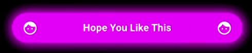

# GlowButton & NeonButton

## Cool Glowing Button and Neon Button with animated properties 
 
# What's new
 In version [](https://jitpack.io/#SMehranB/GlowButton)
 
 •  You can set drawableStart and drawableEnd
 
 •  You can adjust drawablePadding
 
 •  You can set drawableTint
 
 •  You can set disabledTextColor
 
 •  More Glow!
 
 
## Features!

 •	 Background Color, Glow Color, Glow Animation Duration
 
 •	 Corner Radius
 
 •	 Cool Ripple Effect, Ripple Color, Ripple Animation duration, Ripple Effect Enabled
 
 •	 Text Font, Text Style, Text Color, disabledTextColor
 
 •   Drawable Start and End, Drawable Tint, Drawable Padding
 
 •	 Animated Enable/Disable, Enable/Disable
 

## Screen recording
 
     
 
 
# Install
 
```groovy
allprojects {
	repositories {
		...
		maven { url 'https://jitpack.io' }
	}
}
```
## Gradle

```groovy
dependencies {
	 implementation 'com.github.SMehranB:GlowNeonButton:2.0.1'
}
```
## Maven
```xml
<dependency>
	<groupId>com.github.SMehranB</groupId>
	<artifactId>GlowNeonButton</artifactId>
	<version>2.0.1</version>
</dependency>
 ```
# Use
 
## XML

### Glow Button
```xml
<com.smb.glowbutton.GlowButton
    android:id="@+id/myGlowButton"
    android:layout_width="match_parent"
    android:layout_height="wrap_content"
    android:layout_marginHorizontal="16dp"
    android:layout_marginTop="8dp"
    app:gb_drawableStart="@drawable/outline_thumb_up_24"
    app:gb_drawableEnd="@drawable/outline_thumb_down_off_alt_20"
    app:gb_drawablePadding="50dp"
    app:gb_drawableTint="@color/black"
    app:gb_text="I'm confused"
    app:gb_textColor="@color/black"
    app:gb_textSize="16dp"
    app:gb_backgroundColor="#FFE600"
    app:gb_cornerRadius="15dp"
    app:gb_disabledTextColor="#808080"
    app:gb_glowAnimationDuration="500"
    app:gb_glowColor="#FFE600"
    app:gb_rippleAnimationDuration="1500"
    app:gb_rippleColor="@color/purple_500"
    app:gb_rippleEnabled="true" />

<!--Some info on the custom attributes
    app:gb_textSize="24dp" //Default size is 16dp (because I don't like sp. Don't judge me!)
    app:gb_rippleColor="@color/purple_500" //Default ripple color is a darker shade of the background color
    app:gb_rippleEnabled="true" //Default value is true (because who doesn't like ripples?!)
    app:gb_cornerRadius="10dp" //By default, the button has completely round corners 
    app:gb_glowColor="#FFE600" /> //Default value is the same color as the background (because...logic!)
    app:gb_drawablePadding="24dp" //Default value is 8dp
End-->
 ```

### Neon Button
```xml
<com.smb.glowbutton.NeonButton
    android:id="@+id/btnNeonOne"
    android:layout_width="match_parent"
    android:layout_height="wrap_content"
    android:layout_margin="8dp"
    app:nb_cornerRadius="30dp"
    app:nb_disabledStateColor="@android:color/darker_gray"
    app:nb_drawableEnd="@drawable/outline_thumb_up_24"
    app:nb_drawablePadding="32dp"
    app:nb_drawableStart="@drawable/outline_thumb_up_24"
    app:nb_enableAnimationDuration="500"
    app:nb_gradientEnd="#26FF00"
    app:nb_gradientStart="#16FFEC"
    app:nb_text="A Neon Button with Gradient"
    app:nb_textSize="16dp"
    app:nb_textStyle="normal" />
```

## Kotlin
### Glow Button 
```kotlin
val myGlowButton = GlowButton(this)
val params = ConstraintLayout.LayoutParams(ConstraintLayout.LayoutParams.MATCH_PARENT,
    ConstraintLayout.LayoutParams.WRAP_CONTENT)
params.setMargins(16, 8, 16, 0)
myGlowButton.apply {
    layoutParams = params
    setCornerRadius(5)
    glowAnimationDuration = 500 //Increase at your own risk. Long animations are annoying. but whatever...I can't tell you what to do...
    rippleAnimationDuration = 1500 //Relax! It's milliseconds, not hours!
    backColor = Color.WHITE
    glowColor = Color.WHITE
    rippleColor = Color.GRAY //I wouldn't change the ripple color if I were you. But go crazy if you have to.
    setTextSize(16) //Enter desired size in dp (or sp, whatever!)
    setTextColor(Color.BLACK)
    disabledTextColor = Color.DKGRAY
    setDrawableLeft(R.drawable.baseline_face_24)
    drawableTint = Color.BLACK
    setDrawablePadding(16)
    text = "I Am A Glow Button" //There is no `AllCaps` attribute, so do it yourself. Don't be lazy!
    textStyle = Typeface.BOLD_ITALIC
}

viewHolder.addView(myGlowButton)
```

### Neon Button
```kotlin
val myNeonButton = NeonButton(this)
val params = ConstraintLayout.LayoutParams(ConstraintLayout.LayoutParams.MATCH_PARENT,
    ConstraintLayout.LayoutParams.WRAP_CONTENT)
params.setMargins(16, 8, 16, 0)
myNeonButton.apply {
    layoutParams = params
    setCornerRadius(16)
    enableAnimationDuration = 500L
    text = "I Am A Neon Button"
    setTextSize(16)
    disabledStateColor = Color.GRAY
    drawableTint = Color.YELLOW
    setDrawableStart(R.drawable.baseline_face_24)
    setDrawableEnd(R.drawable.baseline_face_24)
    setDrawablePadding(24)
    textStyle = Typeface.ITALIC
    gradientStart = Color.MAGENTA
    gradientEnd = Color.MAGENTA
}

viewHolder.addView(myNeonButton)
```

Both GlowButton and NeonButton have the following functions:
```kotlin
mButton.enableWithAnimation()
mButton.disableWithAnimation()
mButton.enable()
mButton.disable()
```

## 📄 License
```text
MIT License

Copyright (c) 2021 Seyed Mehran Behbahani

Permission is hereby granted, free of charge, to any person obtaining a copy
of this software and associated documentation files (the "Software"), to deal
in the Software without restriction, including without limitation the rights
to use, copy, modify, merge, publish, distribute, sublicense, and/or sell
copies of the Software, and to permit persons to whom the Software is
furnished to do so, subject to the following conditions:

The above copyright notice and this permission notice shall be included in all
copies or substantial portions of the Software.

THE SOFTWARE IS PROVIDED "AS IS", WITHOUT WARRANTY OF ANY KIND, EXPRESS OR
IMPLIED, INCLUDING BUT NOT LIMITED TO THE WARRANTIES OF MERCHANTABILITY,
FITNESS FOR A PARTICULAR PURPOSE AND NONINFRINGEMENT. IN NO EVENT SHALL THE
AUTHORS OR COPYRIGHT HOLDERS BE LIABLE FOR ANY CLAIM, DAMAGES OR OTHER
LIABILITY, WHETHER IN AN ACTION OF CONTRACT, TORT OR OTHERWISE, ARISING FROM,
OUT OF OR IN CONNECTION WITH THE SOFTWARE OR THE USE OR OTHER DEALINGS IN THE
SOFTWARE.
```
