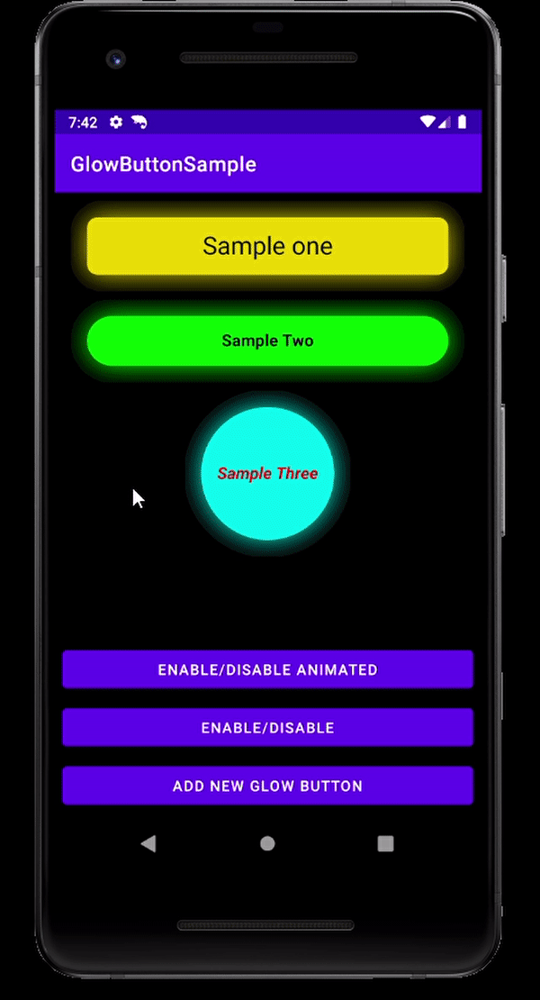

# GlowButton

## A cool glowing button with animated properties 
 
## Features!

•	Background Color, Glow Color, Glow Animation Duration

•	Corner Radius

•	Cool Ripple Effect, Ripple Color, Ripple Animation duration, Ripple Effect Enabled

•	Text Font, Text Style, Text Color

•	Animated Enable/Disable, Enable/Disable


## Screen recording
 
 
 
# Install
 
## Gradle
```
dependencies {
        implementation '-----------------------------'
}
```
## Maven
```
<dependency>
    <???????????????????>
</dependency>
 ```
# Use
 
## XML

GlowButton with custom params:
```
<com.smb.glowbutton.GlowButton
    android:id="@+id/btnSampleOne"
    android:layout_width="match_parent"
    android:layout_height="wrap_content"
    android:layout_marginHorizontal="16dp"
    android:layout_marginTop="8dp"
    android:text="Sample one"
    android:textColor="@color/black"
    android:textSize="24dp" //Default size is 16dp (because I don't like sp. Don't judge me!)
    app:gb_rippleColor="@color/purple_500" //Default ripple color is a darker shade of the background color (you think you are good at UI design? Change it!)
    app:gb_rippleAnimationDuration="1500"
    app:gb_glowAnimationDuration="500"
    app:gb_rippleEnabled="true" //Default value is true (because who doesn't like ripples?!)
    app:gb_backgroundColor="#FFE600" 
    app:gb_cornerRadius="10dp" // By default, the button has completely round corners 
    app:gb_glowColor="#FFE600" /> //Default value is the same color as the background (becasue...logic!)
 ```
## Kotlin
```
val myGlowButton = GlowButton(this)
myGlowButton.apply {
    layoutParams = ViewGroup.LayoutParams(ViewGroup.LayoutParams.MATCH_PARENT,
        ViewGroup.LayoutParams.WRAP_CONTENT)
    glowAnimationDuration = 500 //Increase at your own risk. Long animations are annoying. but whatever...I can't tell you what to do...
    rippleAnimationDuration = 1500 //Calm down! It's milliseconds, not hours!
    backColor = Color.MAGENTA
    glowColor = Color.MAGENTA
    rippleColor = Color.WHITE //I wouldn't change the ripple color if I were you. But go crazy if you have to.
    setTextSize(16) //Enter desired size in dp (or sp, whatever!)
    setTextColor(Color.WHITE)
    text = "Am I Not Cool?!" //There is no `AllCaps` attribute, so do it yourself. Don't be lazy!
    textStyle = Typeface.BOLD_ITALIC
}

viewHolder.addView(myGlowButton)
```

